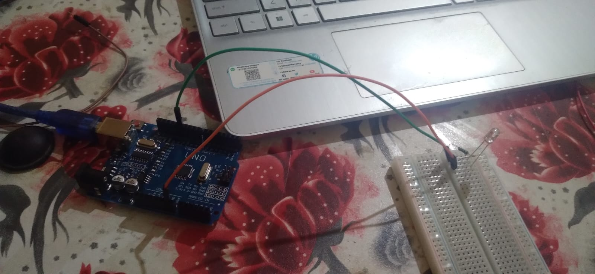
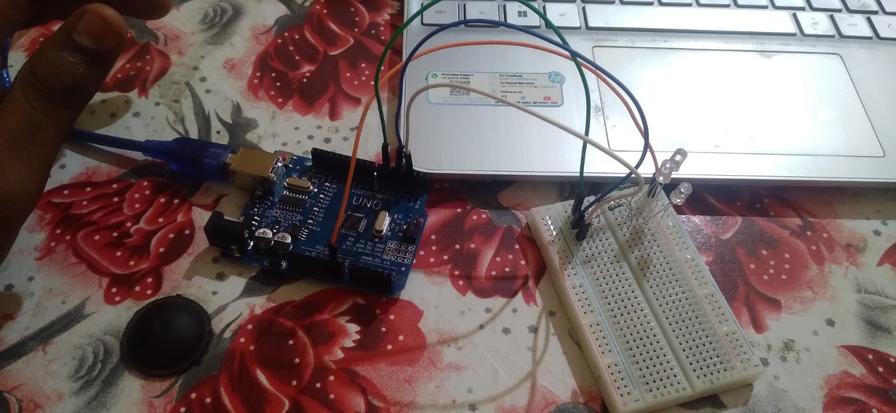

 # Arduino Uno Beginner Projects 🚀

This repository contains my beginner Arduino projects.

---

## 🔴 Project 1 – LED Blink

### Description
This project blinks an LED using Arduino.

### Components
- Arduino Uno
- LED
- 220Ω resistor
- Breadboard
- Jumper wires

### Circuit

### Output

---

## 🚦 Project 2 – Traffic Light

### Description
This project simulates a traffic light system using three LEDs.

- Red → Stop  
- Yellow → Wait  
- Green → Go  

### Components
- Arduino Uno
- 3 LEDs
- Resistors
- Breadboard

### Circuit

### Output
  
  

---

## 📚 What I Learned

- Arduino basics
- pinMode(), digitalWrite()
- Circuit connections
- Debugging errors

---

## 👨‍💻 Author

Sourabh Yadav  
B.Tech Robotics and Automation
