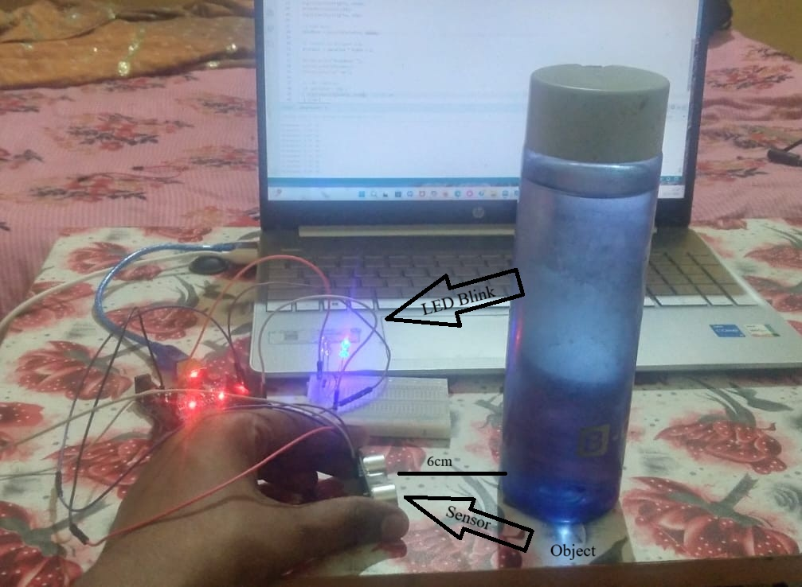
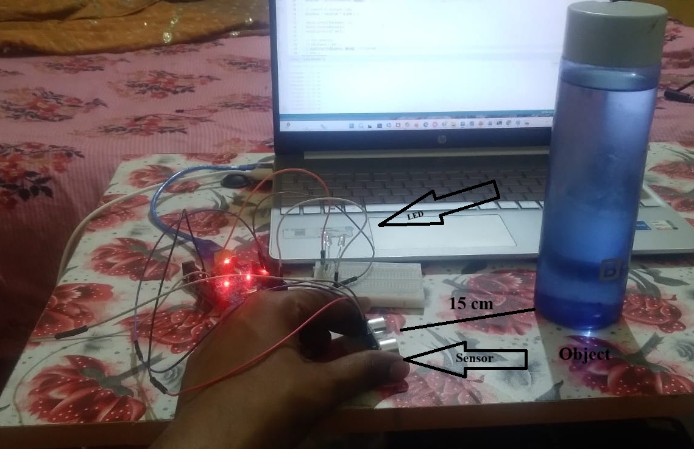

# Arduino Uno Beginner Projects 🚀

This repository contains my beginner Arduino projects.  
I am learning Arduino step by step by building practical hardware projects.

---

## 🔧 Components Used

- Arduino Uno
- LEDs (Red, Yellow, Green)
- Resistors (220Ω)
- Breadboard
- Jumper wires
- Ultrasonic Sensor (HC-SR04)

---

## 🔴 Project 1 – LED Blink

### Description
This is my first Arduino project.  
It simply blinks an LED using digital output.

### Components
- Arduino Uno
- LED
- 220Ω resistor
- Breadboard
- Jumper wires

### Circuit

### Output

---

## 🚦 Project 2 – Traffic Light System

### Description
This project simulates a traffic light system using three LEDs.

- 🔴 Red → Stop  
- 🟡 Yellow → Wait  
- 🟢 Green → Go  

### Components
- Arduino Uno
- 3 LEDs
- Resistors
- Breadboard

### Pin Configuration
- Red LED → Pin 2  
- Yellow LED → Pin 4  
- Green LED → Pin 6  

### Circuit

### Output
  
  

---

## 📡 Project 3 – Distance Detection System

### Description
This project uses an ultrasonic sensor (HC-SR04) to measure distance and control an LED.

- Object near → LED ON  
- Object far → LED OFF  

### Components
- Arduino Uno  
- Ultrasonic Sensor (HC-SR04)  
- LED  
- Resistor  
- Breadboard  

### Pin Configuration
- TRIG → Pin 12  
- ECHO → Pin 9  
- LED → Pin 2  

### Circuit Setup

### Output (Object Near)

### Output (Object Far)

---

## 📚 What I Learned

- Arduino programming basics  
- pinMode(), digitalWrite(), pulseIn()  
- Working with sensors and LEDs  
- Circuit design using breadboard  
- Debugging hardware and code errors  

---

## 🚀 Future Plans

- Combine projects (Traffic + Detection system)  
- Build smart automation projects  
- Add more sensors and modules  
- Improve project documentation  

---

## 👨‍💻 Author

Sourabh Yadav  
B.Tech Robotics and Automation  

---

⭐ Thank you for visiting this repository!
